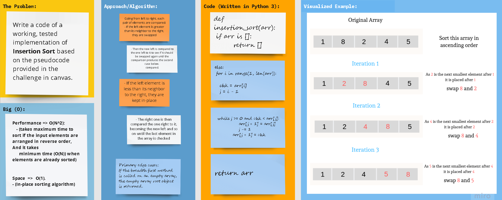

# **Algorithms - Sorting: Insertion Sort**

## Python 3

## Code Challenge 26

## Problem Domain: **Insertion Sort**

### Write a functioning code as per the provided [pseudocode](../../../algorithms_py/sorting/insertion/blog.md)

## Whiteboard Process

# 

## [Approach & Efficiency](../../../algorithms_py/sorting/insertion/blog.md)

## **Code**

### [**`Code`**](../../../algorithms_py/sorting/insertion/insertion_sort.py)

### [**`Tests`**](../../../algorithms_py/tests/test_insertion_sort.py)

