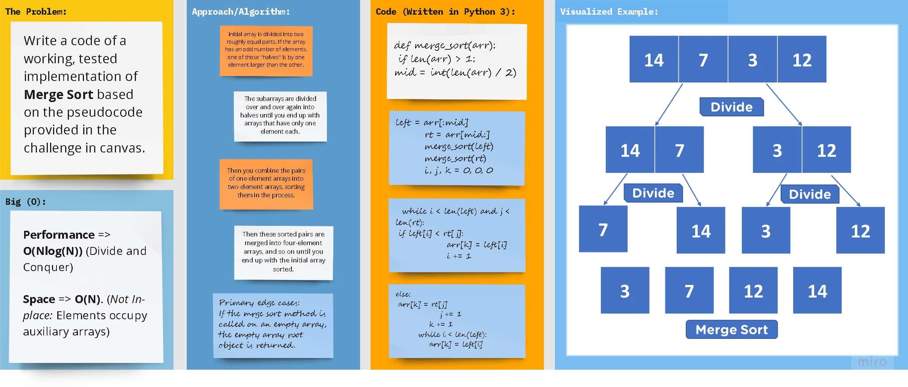

# **Algorithms - Sorting: Merge Sort**

## Python 3

## Code Challenge 27

## Problem Domain: **Merge Sort**

### Write a functioning code as per the provided [pseudocode](../../../algorithms_py/sorting/merge/blog.md)

## Whiteboard Process

# 

## [Approach & Efficiency](../../../algorithms_py/sorting/merge/blog.md)

## **Code**

### [**`Code`**](../../../algorithms_py/sorting/merge/merge_sort.py)

### [**`Tests`**](../../../algorithms_py/tests/test_merge_sort.py)
