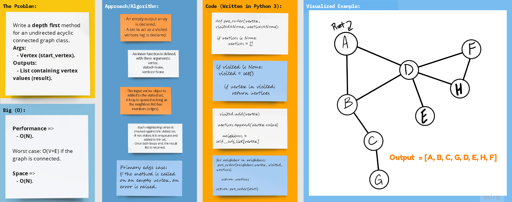

# Python 3

## **Problem Domain: Graphs**

### Code Challenge 38: Extending the Graph class by implementing a Depth First method.

> **Write the following method for the Graph class**

  - Name: `depth_first()`

  - Arguments: Node/Vertex (Starting point of search).

  - Return: Return: A collection of nodes in their pre-order depth-first traversal order.

  - Program output: Display the collection.

# 

## Whiteboard Process

## Approach & Efficiency

### Big (O)

- **Performance => O(N)**, or O(V+E) to be precise.

- **Space => O(N)**, or O(V) to be precise.
    

[//]: # ( using a *`While`* Loop & *`If-elif-else`* statements)

[//]: # (Keeping it as simple as possible, the floor division &#40;`//`&#41; was used to determine where the middle
of the original/input list is, and compare the key with the item at that index.)

## **The Code**

### [**`Code`**](../../data_structures_py/graphs/graphs.py)

### [**`Tests`**](../../data_structures_py/tests/test_graphs.py)
