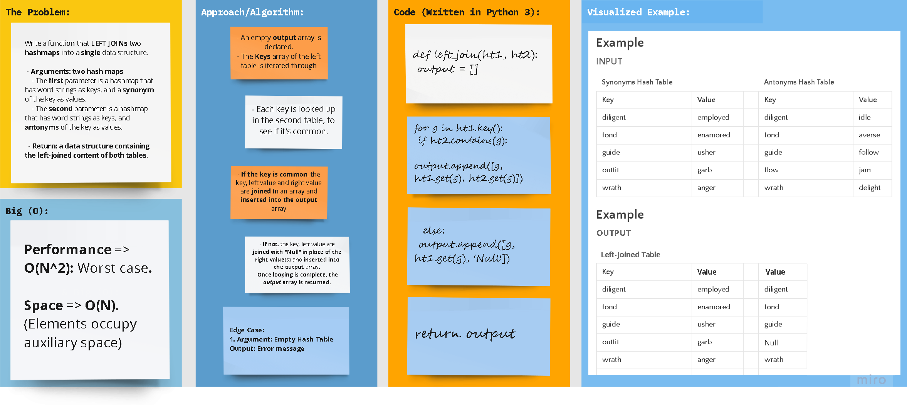

# **Data Structures: Hash Tables**

## Python 3

## Code Challenge 33

## Problem Domain: Hashmap Left Join

> **Write a function that LEFT JOINs two hashmaps into a single data structure.**

  - Arguments: two hash maps.
    - The first parameter is a hashmap that has word strings as keys, and a synonym of the key as values.
    - The second parameter is a hashmap that has word strings as keys, and antonyms of the key as values.

  - Return: The returned data structure that holds the results is up to you, so long as it achieves the LEFT JOIN logic.

# 

## Whiteboard Process

## Approach & Efficiency

### Big (O)

- **Performance => O(N2)** 

- **Space => O(N)**
    

[//]: # ( using a *`While`* Loop & *`If-elif-else`* statements)

[//]: # (Keeping it as simple as possible, the floor division &#40;`//`&#41; was used to determine where the middle
of the original/input list is, and compare the key with the item at that index.)

## **The Code**

### [**`Code`**](../../data_structures_py/hash_tables/hashmap_left_join.py)

### [**`Tests`**](../../data_structures_py/tests/test_hashmap_left_join.py)
