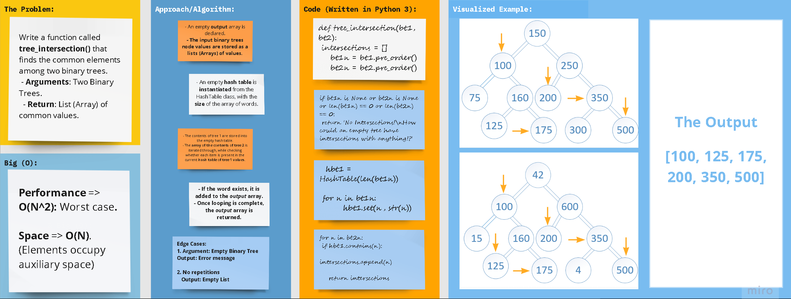

## Python 3

# **Data Structures: Hash Tables, Binary Trees**

## Code Challenge 32

## Problem Domain: Tree Intersections

> **Write a function called `tree_intersection()` that finds the common elements among two binary trees.**
  - Arguments: Two Binary Trees.
  - Return: List (Array) of common values.

# 

## Whiteboard Process

## Approach & Efficiency

### Big (O)

- **Performance => O(N2)** 

- **Space => O(N)**
    

[//]: # ( using a *`While`* Loop & *`If-elif-else`* statements)

[//]: # (Keeping it as simple as possible, the floor division &#40;`//`&#41; was used to determine where the middle
of the original/input list is, and compare the key with the item at that index.)

## **The Code**

### [**`Code`**](../../data_structures_py/hash_tables/tree_intersection.py)

### [**`Tests`**](../../data_structures_py/tests/test_tree_intersection.py)
