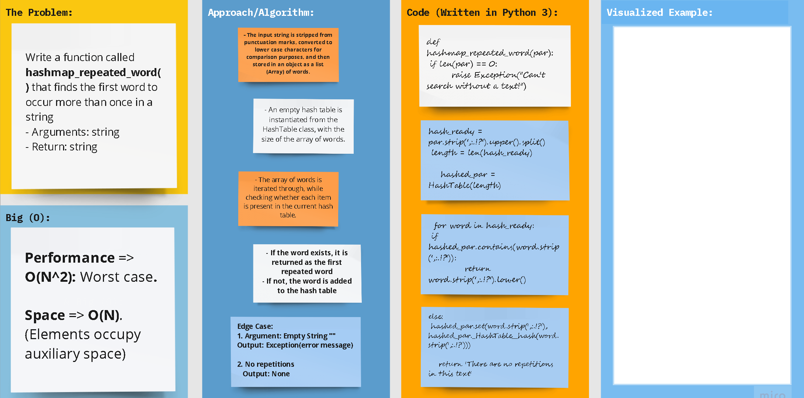

## Python 3

# **Data Structures: Hash Tables**

## Code Challenge 31

## Problem Domain: Hash table first repeats

> **Write a function called **hashmap_repeated_word()** that finds the first word to occur more than once in a string**
  - Arguments: string
  - Return: string

# 

## Whiteboard Process

## Approach & Efficiency

### Big (O)

- **Performance => O(N)** 

- **Space => O(N2)**
    

[//]: # ( using a *`While`* Loop & *`If-elif-else`* statements)

[//]: # (Keeping it as simple as possible, the floor division &#40;`//`&#41; was used to determine where the middle
of the original/input list is, and compare the key with the item at that index.)

## **The Code**

### [**`Code`**](../../data_structures_py/hash_tables/hashmap_repeated_word.py)

### [**`Tests`**](../../data_structures_py/tests/test_hashmap_repeated_word.py)
