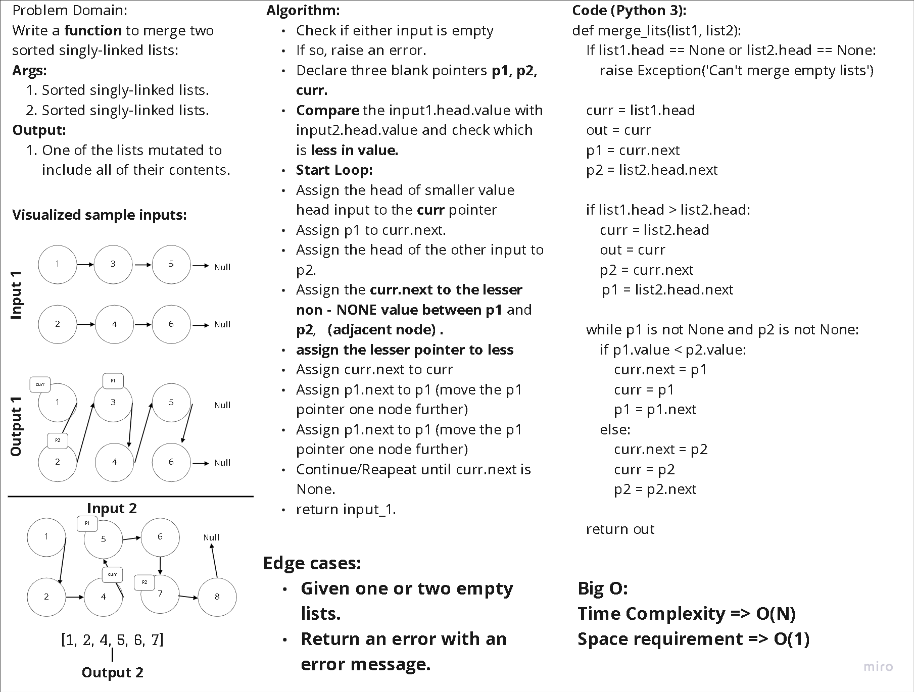

# Lab 36: **Computational Thinking**

## Challenge 1: [**Merge Two Sorted Lists**](https://leetcode.com/problems/merge-two-sorted-lists/)

> **Merge two sorted linked lists and return it as a sorted list. While Maintaining **O(1)** Space Requirements.** [1]

- 

## Challenge 2 : [**Min Stack**](https://leetcode.com/problems/min-stack/)

> **Design a stack that supports push, pop, top, and retrieving the minimum element in constant time.** [2]

## Challenge 3: [**Rotate List**](https://leetcode.com/problems/rotate-list/)

> **Given the head of a linked list, rotate the list to the right by k places.** [3]

[1]: https://leetcode.com/problems/merge-two-sorted-lists/

[2]: https://leetcode.com/problems/min-stack/

[3]: https://leetcode.com/problems/rotate-list/
