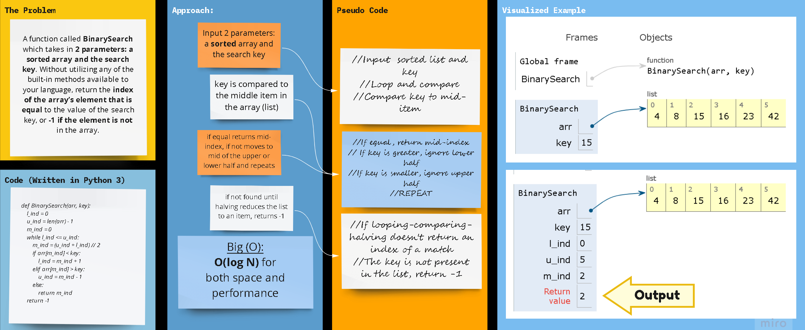

## Python 3

# array_binary_search

A function called `BinarySearch` which takes in 2 parameters: a sorted array and the search key. Without utilizing any of the built-in methods available to your language, return the index of the array’s element that is equal to the value of the search key, or -1 if the element is not in the array.

## Whiteboard Process

## Approach & Efficiency

The arraay/list is looped through while:

1. Comparing the key to the mid-item/element, if equal, the index of said idem is returned.
2. Halving; meaning:

- ignoring the lower half of the sorted array if the key is greater than the mid-item)
- ignoring the upper half of the sorted array if the key is less than the mid-item)

If the previous loop desn't return an index for a matching item, ***-1*** is returned as an indicator that the key was not found in the ordered list.

Big O for both space and time for this approach is **O(log N)**.

## using a *`While`* Loop & *`If-elif-else`* statements

Kepping it as simple as possible, the floor division (`//`) was used to determine where the middle of the original/input list is, and compare the key with the item at that index.

### **`The Code`**

    def BinarySearch(arr, key):
        l_ind = 0
        u_ind = len(arr) - 1
        m_ind = 0
        while l_ind <= u_ind:
            m_ind = (u_ind + l_ind) // 2
            if arr[m_ind] < key:
                l_ind = m_ind + 1
            elif arr[m_ind] > key:
                u_ind = m_ind - 1
            else:
                return m_ind
        return -1
