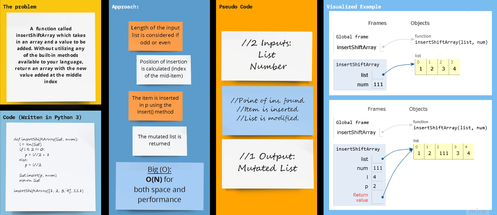

## Python 3

# array_insert_shift

A function called `insertShiftArray` which takes in an array and a value to be added. Without utilizing any of the built-in methods available to your language, return an array with the new value added at the middle index.

## Whiteboard Process

## Approach & Efficiency

Big O for both space and time for this approach is **O(1)**, meaning that they both are constant for the specified pparameters regardless of the inputs.

## using a *`floor & insert`* loop

Kepping it as simple as possible, the floor division (`//`) and the basic list method `insert()` were used to determine where the middle of the original/input list is, and inject the input numer in that position/index, respectively.

### `The Code`

    def insertShiftArray(list, num):
        l = len(list)
        if l % 2 != 0:
          p = l//2 + 1
        else:
         p = l//2
        
        list.insert(p, num)
        return list

    insertShiftArray([1, 2, 3, 4], 111)
