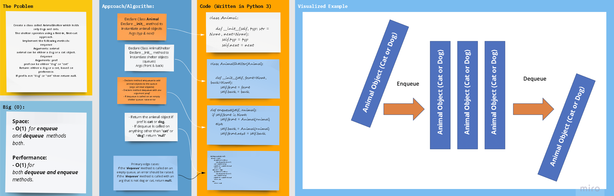

Python 3
Stacks & Queues: Linked List Variants
Code Challenge 12
## Problem Domain: stack_queue_animal_shelter

Create a class called AnimalShelter which holds only dogs and cats.
The shelter operates using a first-in, first-out approach.
Implement the following methods:
enqueue
Arguments: animal
animal can be either a dog or a cat object.
dequeue
Arguments: pref
pref can be either "dog" or "cat"
Return: either a dog or a cat, based on preference.
If pref is not "dog" or "cat" then return null.

## Whiteboard Process

## Approach & Efficiency
- An animal class is created to instantiate animal objects with type `cat` or `dog` and next attributes.
- An Animal Shelter class is created instantiate queues of animal objects.
    - Methods:
         - enqueue
               - Args: animal (object)
               - Output: None
         - dequeue:
               - Args: pref (object)
               - Output: 'cat' or 'dog' or 'null'  

- A check to make sure a queue is not empty before trying to dequeue from its front is necessary, and will 
  raise an exception.

### Big oh 
- _Performance/Time_ complexity **(Big O)** for both the enqueue and dequeue methods is **O(1)**, because enqueuing 
  into a queue requires a constant time to be performed, that is, the time to connect a new element
  into the rear of the queue or disconnect the foremost ine from the front.

- _Space_ requirements **(Big O)** is **O(1)**, because the space required is always constant and equal to that needed
  for a single `animal` object.

[//]: # ( using a *`While`* Loop & *`If-elif-else`* statements)

[//]: # (Kepping it as simple as possible, the floor division &#40;`//`&#41; was used to determine where the middle
of the original/input list is, and compare the key with the item at that index.)

## **`The Code`**

### [**`Code`**](../../data_structures_py/linked_list/stack_queue_animal_shelter.py)

### [**`Tests`**](../../data_structures_py/tests/test_stack_queue_animal_shelter.py)

