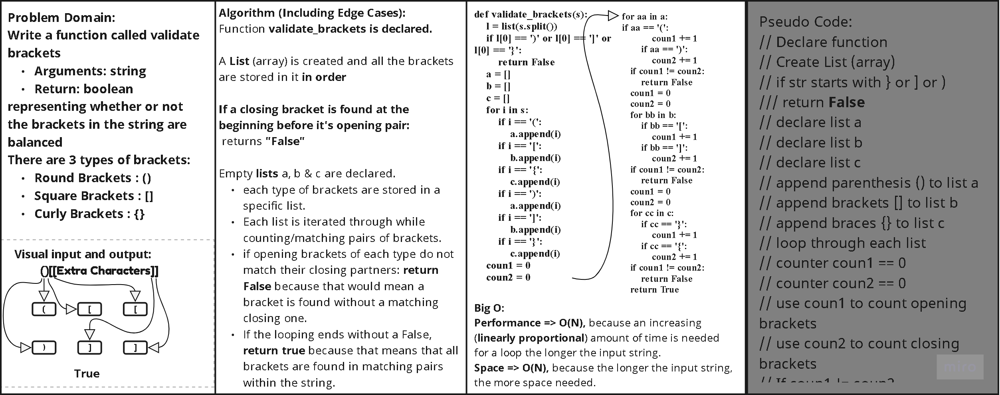

## Python 3

## Code Challenge 13

## Problem Domain: Multi-bracket Validation

Write a function called validate brackets
- Arguments: string
- Return: boolean
- 
representing whether the brackets in the string are balanced.

There are 3 types of brackets:
- Round Brackets : ()
- Square Brackets : []
- Curly Brackets : {}

## Whiteboard Process

## Approach & Efficiency
Algorithm (Including Edge Cases):
Function validate_brackets is declared.

A List (array) is created and all the brackets are stored in it in order

If a closing bracket is found at the beginning before it's opening pair:
 returns "False"

Empty lists a, b & c are declared.
each type of brackets are stored in a specific list.
Each list is iterated through while counting/matching pairs of brackets.
if opening brackets of each type do not match their closing partners: return False because that would mean a bracket 
is found without a matching closing one.
If the looping ends without a False, return true because that means that all brackets are found in matching pairs 
within the string.

### Big oh 
Big O:
- **Performance** => **O(N)**, because an increasing (linearly proportional) amount of time is needed for a loop the longer the input string.
- **Space** => **O(N)**, because the longer the input string, the more space needed.

[//]: # ( using a *`While`* Loop & *`If-elif-else`* statements)

[//]: # (Keeping it as simple as possible, the floor division &#40;`//`&#41; was used to determine where the middle
of the original/input list is, and compare the key with the item at that index.)

## **The Code**

### [**`Code`**](../../data_structures_py/linked_list/stack_queue_brackets.py)

### [**`Tests`**](../../data_structures_py/tests/test_stack_queue_brackets.py)

