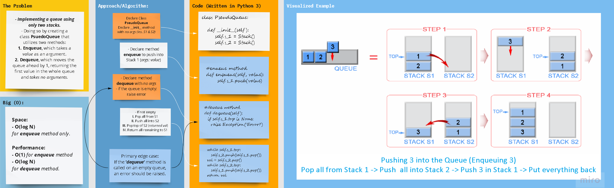

## Python 3

# **Pseudo Queue: Implementing a Queue using only two Stacks**

## _[Code Challenge: Class 11](https://canvas.instructure.com/courses/4839248/assignments/30188573)_

## **Problem Domain:**

### **Pseudo Queue**
- Create a new class called pseudo queue.
- Do not use an existing Queue.
- Instead, this PseudoQueue class will implement our standard queue interface (the two methods listed below),
- Internally, utilize 2 Stack instances to create and manage the queue
- Methods:
   - enqueue
      - Arguments: value
      - Inserts value into the PseudoQueue, using a first-in, first-out approach.

   - dequeue
      - Arguments: none
      - Extracts a value from the PseudoQueue, using a first-in, first-out approach.

     
- NOTE: The Stack instances have only push, pop, and peek methods. You should use your own Stack implementation. Instantiate these Stack objects in your PseudoQueue constructor.

## Whiteboard Process

## Approach & Efficiency
- Utilizing two stacks; s_1 and s_2, enqueue method actually pushes into s_1, and if the dequeue method is called,
  it pops all the items from s_1, pushes them in order into s_2, pops and returns the top of s_2, and then returns
  all the remaining items back to s_1 emptying s_2.

- A check to make sure a queue is not empty before trying to dequeue or peek into its front is necessary, and will raise an exception.

### Big oh 
- _Performance/Time_ complexity **(Big O)** for enqueue method is **O(1) - Constant Time**, because 
  we are actually (functionally) `pushing` into the top of a **stack**, which means that the number
  of existing nodes is irrelevant.

- _Performance/Time_ complexity **(Big O)** for dequeue method is **O(N) - Constant Time**, because 
  we are actually (functionally) `pushing` and `popping` into and from of two **stacks**, which means 
  that the number matters as we are iterating through all existing nodes is necessary.

- _time_ requirements **(Big O)** is **O(N) - Linear Proportion between data and space** when `pushing` into **stacks** or `enqueuing` in **queues**,
   because just like standard linked lists, as more data is added, new `nodes` are created, and memory is used.
   on the other hand.

[//]: # ( using a *`While`* Loop & *`If-elif-else`* statements)

[//]: # (Kepping it as simple as possible, the floor division &#40;`//`&#41; was used to determine where the middle
of the original/input list is, and compare the key with the item at that index.)

## **`The Code`**

### [**`Code`**](../../data_structures_py/linked_list/stack_queue_pseudo.py)

### [**`Tests`**](../../data_structures_py/tests/test_stack_queue_pseudo.py)

