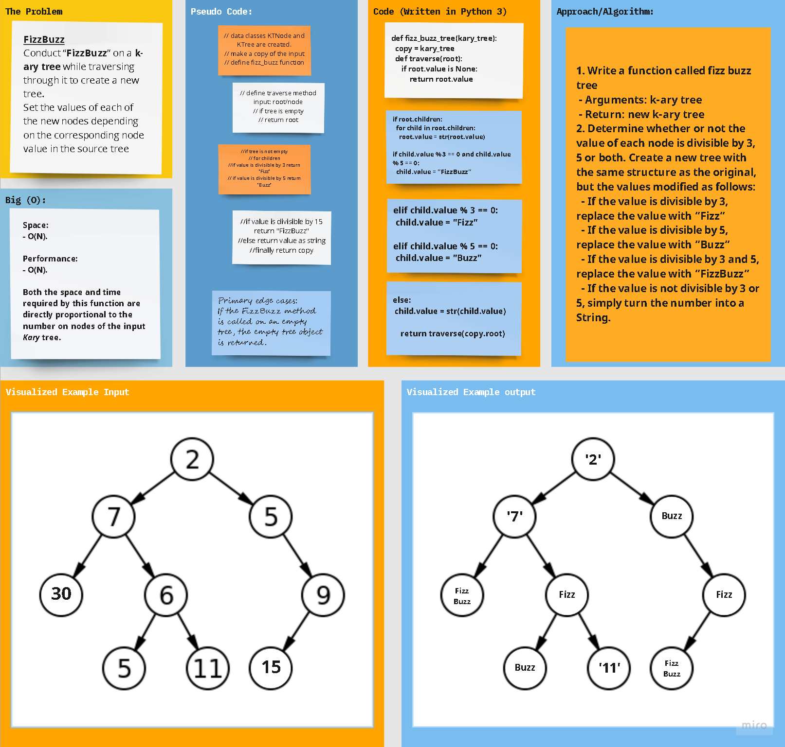

## Python 3

# **Data Structures: Kary Trees**

## Code Challenge 18

## Problem Domain: **Kary Tree fizz-buzz**

## Feature Tasks

### Write a function called **`tree_fizz_buzz()`**

Write a function called fizz buzz tree
- Arguments: k-ary tree
- Return: new k-ary tree
Determine whether the value of each node is divisible by 3, 5 or both. Create a new tree with the same structure as the original, but the values modified as follows:

- If the value is divisible by 3, replace the value with “Fizz”
- If the value is divisible by 5, replace the value with “Buzz”
- If the value is divisible by 3 and 5, replace the value with “FizzBuzz”
- If the value is not divisible by 3 or 5, simply turn the number into a String.

#

## Whiteboard Process

# 

## Approach & Efficiency

### Code challenge 18: **`Kary Tree fizz-buzz`**

- **Kary Tree Node** Class is defined as a template for Kary tree node instances.

- **Kary Tree Class** is defined as a template for Kary tree instances.

- **`tree_fizz_buzz()`** function is defined:
  - Arguments
    - Kary Tree Object with numerical node values.
  - Outputs
    - Kary Tree Object with no numerical node values, and with fizz-buzz logic implemented.

### Big (O)

- **Performance** =>
    - For `tree_fizz_buzz()` method: **O(N)**, where N is the number of nodes in the input tree.
  

- **Space** => 
    - For `tree_fizz_buzz()` method: **O(N)**.  where N is the number of nodes in the input tree.

## **The Code**

### [**`Code`**](../../data_structures_py/trees/tree_fizz_buzz.py)

### [**`Tests`**](../../data_structures_py/trees/test_tree_fizz_buzz.py)

