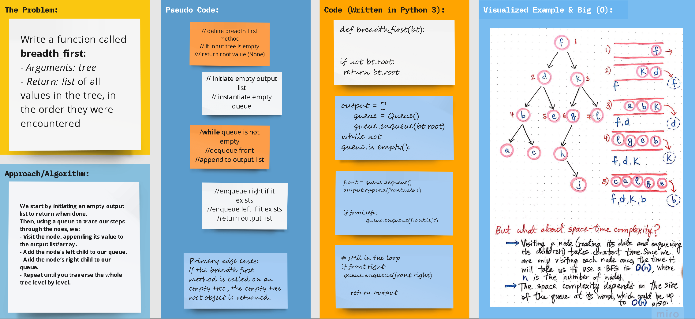

## Python 3

# **Data Structures: Trees**

## Code Challenge 17

## Problem Domain: **Breadth-first Traversal**

### Write a function called **`breadth_first()`**
  **- Arguments: tree**

  **- Return: list of all values in the tree, in the order they were encountered**
#
## Whiteboard Process

# 

## Approach & Efficiency

### Code challenge 17: **`Breadth-first Traversal`**

We start by initiating an empty output list to return when done.
Then, using a **queue** to trace our steps through the noes, we:
- Visit the node, appending its value to the output list/array. 
- Add the node’s left child to our queue.
- Add the node’s right child to our queue.
- Repeat until you traverse the whole tree level by level.

### Big (O)

- **Performance** =>
    - For `breadth_first()` method: **O(h)**, where h is the height of the tee.
  

- **Space** => 
    - For `breadth_first()` method: **O(N)**. The space occupied by the queue and the output increases the more nodes the tree has.

## **The Code**

### [**`Code`**](../../data_structures_py/trees/breadth_first.py)

### [**`Tests`**](../../data_structures_py/trees/test_breadth_first.py)

