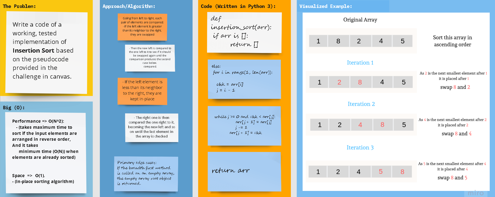

# **Algorithms - Sorting: Insertion Sort**

## Python 3

## Code Challenge 26

## Problem Domain: **Insertion Sort**

### Write a functioning code as per the provided pseudocode

## Whiteboard Process

# 

## Approach

### **Pseudocode**
        
    InsertionSort(int[] arr)
    
        FOR i = 1 to arr.length
    
            int j <-- i - 1
            int temp <-- arr[i]
      
            WHILE j >= 0 AND temp < arr[j]
              arr[j + 1] <-- arr[j]
              j <-- j - 1
      
            arr[j + 1] <-- temp

### **Trace**

#### **Sample Array: [**`8`** ,   **`4`** ,   **`23`** ,   **`42`** ,   **`16`** ,   **`15`**]**

1. First Pass:
   - The first two elements of the array are compared.

>  #### **8** ,   **4** ,   **`23`** ,   **`42`** ,   **`16`** ,   **`15`**  

   - Here, 8 is greater than 4, so they are not in the ascending order. Thus, 4 and 8 are swapped.
   - So, for now 4 is stored in a sorted sub-array.

2. Second Pass:

   - Now, move to the next two elements and compare them
>  #### _4_ ,   **8** ,   **23** ,   **`42`** ,   **`16`** ,   **`15`**  
   - Here, 23 is greater than 8, thus the two elements are in ascending order, hence, no swapping will occur.
     8 is also stored in a sorted sub-array along with 4

3. Third Pass:

   - Now, two elements are present in the sorted sub-array which are 4 and 8
   - Moving forward to the next two elements which are 23 and 42
>  #### _4_ ,   _8_ ,   **23** ,   **42** ,   **`16`** ,   **`15`**  
   - Here, 42 is greater than 23, thus the two elements are in ascending order, hence, no swapping will occur for now.

4. Fourth Pass:

   - Now, the elements which are present in the sorted sub-array are 4, 8 and 23.
   - Moving to the next two elements 42 and 16.
>  #### _4_ ,   _8_ ,   **`23`** ,   **42** ,   **16** ,   **`15`**  
   - Clearly, they are not sorted, so we perform swap between both.
>  #### _4_ ,   _8_ ,   **23** ,   **16** ,   **`42`** ,   **`15`**  
   - Now we compare the newly switched 16 with its predecessor 23.
   - They are in descending order, so we swap them as well.
>  #### _4_ ,   *8* ,   *16* ,   *23* ,   *42* ,   **`15`**
   - Now we compare the newly switched 16 with its new predecessor 8.
   - They are in ascending order, hence, no swapping will occur here.

4. Fifth Pass:

   - Now, the elements which are present in the sorted sub-array are 4, 8, 16, 23 and 42.
   - Moving to the last two elements 42 and 15.

>   _4_ ,   *8* ,   *16* ,   *23* ,   **42** ,   **15**

   - Clearly, they are not sorted, so we perform swap between both.

>   _4_ ,   *8* ,   *16* ,   **23** ,   **15** ,   *42*
 
   - Now we compare the newly switched 15 with its new predecessor 23. They are switched to give:

>   _4_ ,   *8* ,   **16** ,   **15** ,   *23* ,   *42*

   - The same logic applies to 15 and its new predecessor 16, so we swap again.

>   _4_ ,   **8** ,   **15** ,   *16* ,   *23* ,   *42*

   - Comparing 15  and 8, we can see that 15a has reached its correct place.
   - This concludes the sorting process because we have iterated through the whole array comparing and moving elements.

#### The output: [  _`4`_ ,   **`8`** ,   **`15`** ,   *`16`* ,   *`23`* ,   *`42`*  ]

### **Efficiency**

- **Performance** => **O(N^2)**:
   - (takes maximum time to sort if the input elements are arranged in reverse order, And it takes
     minimum time (O(N)) when elements are already sorted)
  

- **Space** => **O(1)**. (_In-place_ sorting algorithm)

## **The Code**

### [**`Code`**](insertion_sort.py)

### [**`Tests`**](../../../algorithms_py\tests\test_insertion_sort.py)

