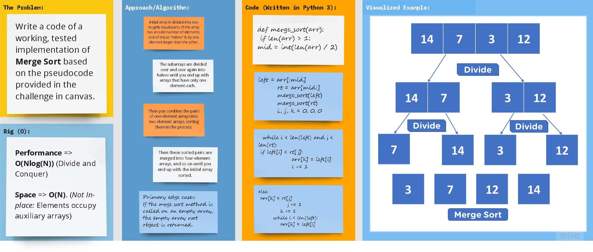

# Merge Sort

# 

## Approach

### **Pseudocode**
        
      ALGORITHM Mergesort(arr)
          DECLARE n <-- arr.length
      
          if n > 1
            DECLARE mid <-- n/2
            DECLARE left <-- arr[0...mid]
            DECLARE right <-- arr[mid...n]
            // sort the left side
            Mergesort(left)
            // sort the right side
            Mergesort(right)
            // merge the sorted left and right sides together
            Merge(left, right, arr)
      
      ALGORITHM Merge(left, right, arr)
          DECLARE i <-- 0
          DECLARE j <-- 0
          DECLARE k <-- 0
      
          while i < left.length && j < right.length
              if left[i] <= right[j]
                  arr[k] <-- left[i]
                  i <-- i + 1
              else
                  arr[k] <-- right[j]
                  j <-- j + 1
      
              k <-- k + 1
      
          if i = left.length
             set remaining entries in arr to remaining values in right
          else
             set remaining entries in arr to remaining values in left
   

## **Trace**

#### **Sample Array: [**`8`** ,   **`4`** ,   **`23`** ,   **`42`** ,   **`16`** ,   **`15`**]**

1. At first, we calculate its midpoint

>   **8** ,   **4** ,   **23** ,   **42** ,   **16** ,   **15**  

   - Here, the midpoint index is 3

2. Then,  the whole array is iteratively divided into equal halves

>  [**`8`** ,   **`4`** ,   **`23`**] - - - - [**`42`** ,   **`16`** ,   **`15`**]

>  [**`8`** ,   **`4`**]  -   [**`23`**]  --  [**`42`** ,   **`16`**] - [**`15`**] 

>  [**`8`**] - [**`4`**]  -   [**`23`**]  -  [**`42`**] - [**`16`**] - [**`15`**] 

3. Now that the list/array have been divided into arrays of its individual elements, We begin merging
   
   - We compare each pair of elements and merge them accordingly.

>  [ **`4`** ,  **`8`** ] - [ **`23`** ,  **`42`** ] - [ **`16`** ,  **`15`** ] 

   - We continue merging until all the sub-arrays are merged into one sorted versiko

#### The output: [  `4` ,   `8` ,   `15` ,   `16` ,   `23` ,   `42`  ]

### **Efficiency**

- **Performance** => **O(Nlog(N))** (Divide and Conquer)
  

- **Space** => **O(N)**. (_Not In-place:_ Elements occupy auxiliary arrays)
