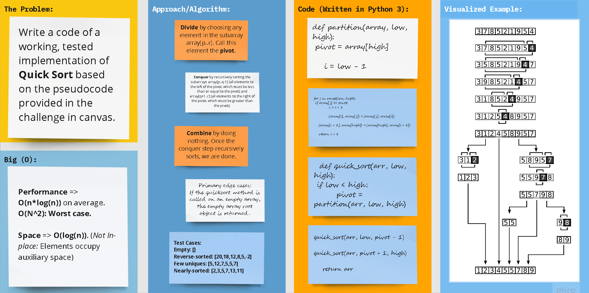

# Merge Sort

# 

## Approach

### **Pseudocode**
        
      ALGORITHM QuickSort(arr, left, right)
          if left < right
              // Partition the array by setting the position of the pivot value
              DEFINE position <-- Partition(arr, left, right)
              // Sort the left
              QuickSort(arr, left, position - 1)
              // Sort the right
              QuickSort(arr, position + 1, right)
      
      ALGORITHM Partition(arr, left, right)
          // set a pivot value as a point of reference
          DEFINE pivot <-- arr[right]
          // create a variable to track the largest index of numbers lower than the defined pivot
          DEFINE low <-- left - 1
          for i <- left to right do
              if arr[i] <= pivot
                  low++
                  Swap(arr, i, low)
      
           // place the value of the pivot location in the middle.
           // all numbers smaller than the pivot are on the left, larger on the right.
           Swap(arr, right, low + 1)
          // return the pivot index point
           return low + 1
      
      ALGORITHM Swap(arr, i, low)
          DEFINE temp;
          temp <-- arr[i]
          arr[i] <-- arr[low]
          arr[low] <-- temp
   

### **Trace**

#### **Sample Array: [**`8`** ,   **`4`** ,   **`23`** ,   **`42`** ,   **`16`** ,   **`15`**]**

1. At first, we choose a **pivot**, here, let's make the right-most index value (15) the pivot.

>   **8** ,   **4** ,   **23** ,   **42** ,   **16** ,   *15*  

2. partition the array using pivot value

3. We take two variables to point left and right of the list excluding
   - left points to the low index (`8`)
   - right points to the high (`16`)

>   **`8`** ,   **4** ,   **23** ,   **42** ,   **`16`** ,   *15*

4. if right ≥ left, move the pointers to different values.
5. if left ≥ right, swap the two elements.

>   **8** ,   **`4`** ,   **23** ,   **`42`** ,   **16** ,   *15*  

6. If the two pointers meet at an element, its index is the correct index for the pivot.
    - Here, they met at `23`, whose index is 2, meaning that the pivot should be placed here to partition the array.

>   **8**  ,   **4**  ,   *15*   ,   **23**  ,   **42**  ,   **16**   

7. We get two partitions centered about the pivot as follows
   
> [   **8**  ,   **4**  ]   *15*   [   **23**  ,   **42**  ,   **16**   ]   

8. We now apply the same logic on the two partitions in recursive fashion to get them ordered as well.
    - Partition 1: [  **8**  ,  **4**  ], we choose `8` to be the new pivot here and sort in one step.
    - Partition 1: [  **23**  ,  **42**  ,  **16**  ], we choose `16` to be the new pivot here and sort in two steps.

9. Joining the two now-sorted partitions with the original pivot, we get the sorted output.

#### The output: [  `4` ,   `8` ,   `15` ,   `16` ,   `23` ,   `42`  ]

### **Efficiency**

- **Performance** => (Divide and Conquer)
  - **Average:O(nlog(n))** (If a good pivot is chosen)
  - **Worst:O(n2))** (If the chosen pivot is the worst option)
  

- **Space** => **O(log n)**. (_Not In-place:_ Elements occupy auxiliary space)
